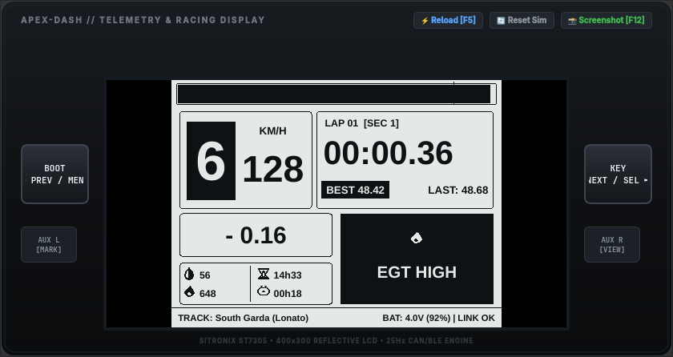
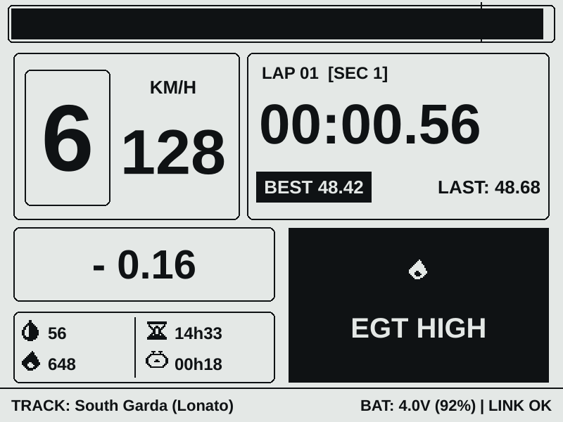
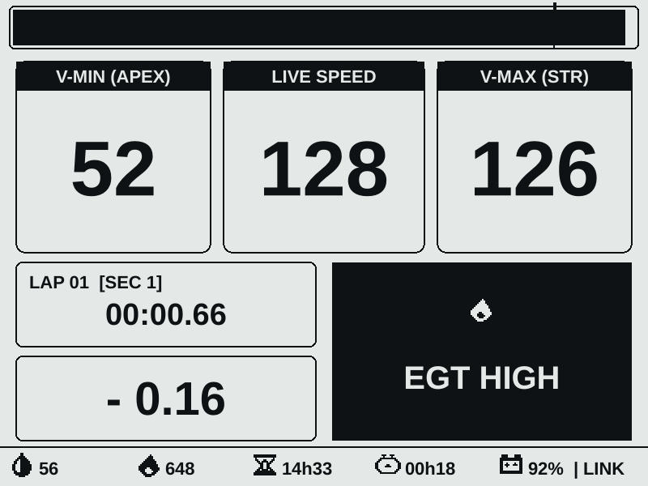
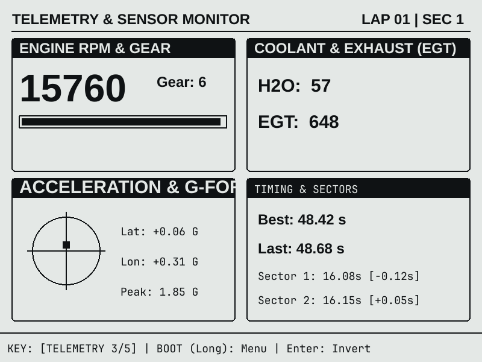

# Apex-Twin

> [!WARNING]
> ### ⚠️ WORK IN PROGRESS — NOT YET FUNCTIONAL
> **Apex-Twin is currently under active development and is NOT yet fully functional or ready for on-track racing use.**  
> Hardware pinouts, communication protocols, firmware interfaces, and telemetry schemas are subject to ongoing changes.

**Apex-Twin** is an open-source, dual-module telemetry, data logging, and live racing display ecosystem engineered specifically for go-karting.

---

## 📸 Dashboard Preview

<div align="center">



*Apex-Dash steering wheel unit running the flagship 25 Hz Live Race HUD on a 4.2" Sitronix ST7305 Reflective LCD with WS2812 RGB shift light bar.*

</div>

<br/>

| **Live Race HUD (KZ Shifter)** | **Schumacher 3-Speedometer HUD** | **Telemetry & G-G Diagram** |
| :---: | :---: | :---: |
|  |  |  |

---

## 1. System Presentation & Concept

Commercial kart data loggers traditionally route high-voltage sparkplug leads, thermocouple cables, and power wiring directly up the steering column, leading to cable fatigue and ignition electromagnetic interference. 

**Apex-Twin** decouples **Acquisition & Logging** from **Visualization**:

```text
       ┌────────────────────────┐                   ┌────────────────────────┐
       │      APEX-TRACK        │                   │       APEX-DASH        │
       │    (Chassis Module)    │   ESP-NOW 2.4GHz  │ (Steering Wheel Unit)  │
       │                        │ ════════════════> │                        │
       │  • 25 Hz Dual-Band GNSS│    (Sub-2ms,      │  • 4.2" Reflective LCD │
       │  • 6-Axis High-G IMU   │     25 Hz)        │  • WS2812 Shift LEDs   │
       │  • RPM & Dual Temps    │                   │  • 18650 Li-Ion (Wire- │
       │  • High-Rate SD Logger │                   │    Free Operation)     │
       └────────────────────────┘                   └────────────────────────┘
```

* **Apex-Track (Chassis):** Rigidly mounted to the kart frame; acquires high-rate GNSS, IMU dynamics, engine RPM, and dual temperatures (Water/EGT), logging raw data to MicroSD while broadcasting live frames at $25\text{ Hz}$.
* **Apex-Dash (Steering Wheel):** Wire-free steering display powered by an onboard 18650 cell; features a high-contrast $400 \times 300$ sunlight-readable Reflective LCD (Sitronix ST7305), 7x WS2812 RGB shift/alarm LEDs, and predictive lap timing.

---

## 2. Quickstart

### Environment Setup
Clone the repository and initialize the Python environment with unified CLI tools:

```bash
# Clone repository
git clone https://github.com/lcecconi/Apex-Twin.git
cd Apex-Twin

# Set up virtual environment and install all dependencies
source setup_env.sh
```

### Essential Commands (`apex`)

```bash
# 1. Launch Desktop Hardware & Telemetry Emulator
apex emu                               # Run 25 Hz kart physics simulation
apex emu --replay session_lonato.csv   # Replay recorded session log

# 2. Build & Flash Module Firmware (PlatformIO)
apex build dash                        # Compile Apex-Dash display firmware
apex flash dash                        # Build & flash connected display module
apex monitor dash                      # Open live serial telemetry monitor

# 3. Validation & Tests
apex test                              # Run syntax checks and emulator smoke tests
```

*(You can also use standard Make targets: `make emu`, `make build`, `make flash`, `make monitor`, `make test`).*

---

## 3. Sub-Module & Hardware Documentation

Detailed technical documentation, schematics, and guides are organized into dedicated sub-documents:

* 🖥️ **[Apex-Dash Display Documentation](file:///home/leonardo/Dev/Apex-Twin/apex-dash/README.md)**  
  *Detailed guide covering the 5 racing HUD views (including the historical Schumacher 3-speedometer layout), 7-level setup menu system, and firmware architecture.*

* 🏎️ **[Apex-Track Chassis Module](file:///home/leonardo/Dev/Apex-Twin/apex-track/README.md)**  
  *Chassis data acquisition module, GNSS receiver, inductive RPM conditioning, and sensor wiring.*

* 💻 **[Desktop Hardware Emulator Guide](file:///home/leonardo/Dev/Apex-Twin/emu/README.md)**  
  *High-fidelity PySide6 desktop emulator with multi-source telemetry, session replayer, and screenshot export tools.*

* 📐 **[System Architecture & Design Analysis](file:///home/leonardo/Dev/Apex-Twin/docs/architecture.md)**  
  *In-depth architectural breakdown of the dual-module wireless topology.*

* 🔌 **[Connector & Pinout Specification](file:///home/leonardo/Dev/Apex-Twin/docs/connector_pinout.md)**  
  *Wiring harnesses, JST pinout definitions, and electrical specifications.*

* 📡 **[ESP-NOW Latency & Throughput Benchmark Suite](file:///home/leonardo/Dev/Apex-Twin/tests/espnow-latency/README.md)**  
  *Microsecond-precision test harness to measure round-trip time (RTT), jitter, and packet loss between ESP32 modules.*
