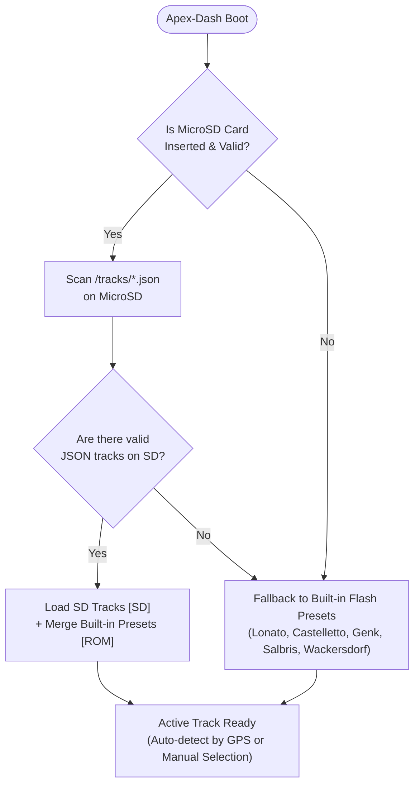

# Apex-Twin

**Apex-Twin** is an open-source, dual-module telemetry, data logging, and live racing display ecosystem for go-karts.

The system is split into two specialized modules:
* **Apex-Track:** Chassis-mounted data acquisition and high-rate sensor logging module.
* **Apex-Dash:** Wireless steering-wheel live display and analysis unit inspired by the  Apex-Dash.

---

## 1. System Architecture

The twin-module topology isolates high-vibration sensor wiring and high-voltage ignition leads on the chassis, allowing the steering-wheel unit to operate completely wire-free:

```text
       ┌────────────────────────┐                   ┌────────────────────────┐
       │      APEX-TRACK        │                   │       APEX-DASH        │
       │   (Chassis Module)     │                   │ (Steering Wheel Unit)  │
       │                        │   ESP-NOW 2.4GHz  │                        │
       │  • High-Rate GNSS      │ ════════════════> │  • 4.2" Reflective LCD │
       │  • 6-Axis IMU          │    (Sub-5ms,      │  • WS2812 Shift LEDs   │
       │  • Sparkplug RPM Lead  │     25 Hz)        │  • MicroSD Track DB    │
       │  • Water & EGT Temps   │                   │  • Multilingual UI     │
       └────────────────────────┘                   └────────────────────────┘
```

* **[Apex-Dash Detailed Documentation](file:///home/leonardo/Dev/Apex-Twin/apex-dash/README.md)**
* **[Implementation & Enhancement Plan](file:///home/leonardo/Dev/Apex-Twin/docs/apex_dash_implementation_plan.md)**
* **[Feature Status & Apex-Dash Comparison](file:///home/leonardo/Dev/Apex-Twin/docs/apex-dash_unported_features.md)**

---

## 2. Track Management & GPS Database

Apex-Dash uses an open JSON circuit format to define track coordinates, start/finish line gates, and sector splits.

### A. Downloading & Generating Track Files

Use the included track downloader script to generate circuit files:

```bash
# 1. Generate 15 curated international championship tracks (Lonato, Sarno, Genk, Salbris, Zuera, etc.)
python3 scripts/download_tracks.py --builtin

# 2. Query OpenStreetMap live for all karting circuits in a specific country
python3 scripts/download_tracks.py --country IT
python3 scripts/download_tracks.py --country FR
python3 scripts/download_tracks.py --country DE

# 3. Search OpenStreetMap for a specific circuit by name
python3 scripts/download_tracks.py --search "South Garda"
```

The script saves `.json` circuit files into the local `tracks/` directory.

---

### B. Loading Tracks onto the MicroSD Card

There are two methods to load tracks onto the dashboard:

#### Method 1: Direct SD Card Copy (PC / Card Reader)
1. Insert a FAT32-formatted MicroSD card into your computer.
2. Copy the `.json` files from `tracks/` into the `/tracks/` folder on the root of the SD card.
3. Insert the MicroSD card into the TF slot on the Waveshare ESP32-S3-RLCD board.

#### Method 2: On-Board USB Mass Storage Mode (No Card Removal)
1. Turn on the dashboard and open the Setup Menu (**Long Press BOOT**).
2. Navigate to `4. Storage & PC Sync` $\rightarrow$ `Start PC USB Drive`.
3. Connect the dashboard to your PC using a USB-C cable.
4. The MicroSD card will mount as a standard USB removable drive. Drop your `.json` files into `/tracks/`.
5. Press **BOOT** or **KEY** to safely exit USB mode and return to the dashboard.

---

### C. Track Retrieval & Fallback Hierarchy

When Apex-Dash boots or opens the **Track & GPS Database** menu, it retrieves tracks according to the following hierarchy:



1. **If the SD Card is missing or empty:** Apex-Dash automatically falls back to its internal ROM track library stored in Flash memory (*South Garda Lonato, Circuito 7 Laghi, Karting Genk, Salbris International, Prokart Wackersdorf*). The display remains 100% operational without requiring an SD card.
2. **If the SD Card is present:** Apex-Dash parses all custom `/tracks/*.json` files and presents them in the track selection menu with an `[SD]` badge.
3. **Live Refresh:** Drivers can trigger **"Reload Tracks from SD"** directly from the menu at the track without restarting the device.
