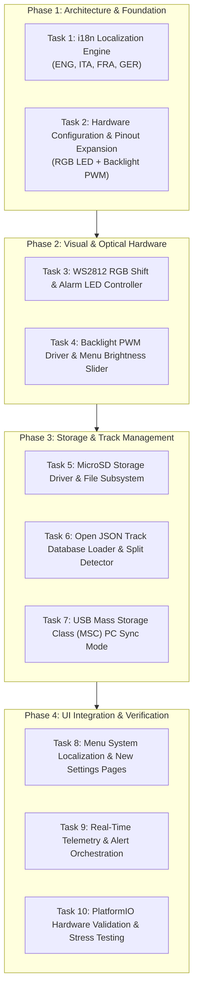

# Apex-Dash: Comprehensive Implementation & Enhancement Plan

> **Target Platform:** Waveshare ESP32-S3-RLCD-4.2 (ESP32-S3-WROOM-1-N16R8, 4.2" Sitronix ST7305 RLCD, MicroSD Slot, Onboard SHTC3/PCF85063A)  

---

## 1. Scope & Objectives

This document outlines the engineering architecture, hardware pin allocation, work breakdown structure (WBS), and verification strategy for porting the approved features to **Apex-Dash**:

1. **WS2812 RGB LED Strip Controller:**
   * 5-LED progressive RPM shift bar + 2 dedicated multi-color Alarm/Warning LEDs on a free expansion GPIO.
2. **PWM Backlight Driver Signal:**
   * Configurable ESP32 LEDC PWM output pin for driving an external steering-wheel backlight harness with menu brightness control.
3. **Multi-Language (i18n) Localization:**
   * Full string table engine supporting **English (ENG - default)**, **Italian (ITA)**, **French (FRA)**, and **German (GER)** across all menus, telemetry HUDs, dialogs, and alarm banners.
4. **MicroSD Card & Open Track Database Loader:**
   * Open JSON/GeoJSON circuit library support loaded from the onboard MicroSD card (`/tracks/` folder) with fallback flash circuits and sector split timing.
5. **Non-Breaking USB Mass Storage Class (MSC):**
   * Safe menu-activated USB storage mode exposing the MicroSD card as a USB drive to a PC for track upload and log extraction without breaking serial firmware uploading or monitoring.

### Items Skipped / Dropped per User Decision

* **Direct Sparkplug RPM Lead:** Handled by chassis module (**Apex-Track**) over ESP-NOW.
* **Analog Thermocouple Inputs (CHT / EGT / Water TR):** Wired directly to **Apex-Track**.
* **Expansion CAN Bus & Analog Expansion:** Handled by **Apex-Track**.
* **Oval Racing Mode:** Dropped from scope.
* **BLE Heart Rate Monitor:** Dropped to eliminate radio coexistence overhead with ESP-NOW.
* **On-Screen 2D Track Map Playback & Tire Temp Grid:** Skipped for now.

---

## 2. Hardware Pinout Allocation & Expansion Mapping

The **Waveshare ESP32-S3-RLCD-4.2** board exposes header pins that map to internal peripherals and expansion connectors:

| Function / Peripheral | Signal Name | ESP32-S3 GPIO | Bus / Protocol | Notes & Design Rationale |
| :--- | :--- | :--- | :--- | :--- |
| **RLCD Display** | `SCK`, `MOSI`, `DC`, `CS`, `RST` | GPIO 11, 12, 5, 40, 41 | SPI (24 MHz) | Sitronix ST7305 400x300 Daylight Reflective |
| **I2C Shared Bus** | `SDA`, `SCL` | GPIO 13, 14 | I2C (400 kHz) | SHTC3 (0x70) + PCF85063A (0x51) |
| **MicroSD (TF Slot)** | `SD_CLK`, `SD_CMD`, `SD_DAT0` | GPIO 39, 38, 47 | SDMMC 1-Bit / SPI | Onboard slot for track DB & logs |
| **Battery Voltage** | `VBAT_ADC` | GPIO 4 | ADC1_CH3 | 1/3 voltage divider (200kΩ/100kΩ) |
| **Onboard Buttons** | `BOOT`, `KEY` | GPIO 0, 18 | Digital In (Pull-up) | Short/Long press navigation & selection |
| **RGB Shift/Alarm Strip** | `RGB_LED_DATA` | **GPIO 1** | RMT / NeoPixel (WS2812B) | 7x Addressable RGB LEDs (5 Shift + 2 Alarms) |
| **PWM Backlight Output** | `BACKLIGHT_PWM` | **GPIO 2** | ESP32 LEDC (5 kHz PWM) | 0–100% duty cycle signal to external LED driver |
| **Aux Steering Buttons** | `AUX_BTN_LEFT`, `AUX_BTN_RIGHT` | **GPIO 3, 17** | Digital In (Pull-up) | Optional wheel-mounted thumb buttons |

---

## 3. Work Breakdown Structure (WBS) & Implementation Details



---

### Phase 1: Architecture & Localization Foundation

#### **Task 1: Multi-Language (i18n) Engine**

* **Goal:** Implement a string dictionary system supporting English, Italian, French, and German without heap fragmentation.
* **Key Components:**
  * Define `Language` enum (`LANG_EN = 0`, `LANG_IT = 1`, `LANG_FR = 2`, `LANG_DE = 3`).
  * Define string tokens covering:
    * Menu categories (Race Setup, Shift Lights, Track GPS, Storage PC, Display PWM, System Language, Diagnostics).
    * HUD labels (`SPEED`/`VEL`/`VIT`/`GESCH`, `RPM`/`GIRI`/`TR/M`/`U/MIN`, `GEAR`/`MARC`/`RAPP`/`GANG`, `LAP`/`GIRO`/`TOUR`/`RUNDE`, `BEST`, `DELTA`, `PRED`, `SECTOR`).
    * Real-time warning banners (`SHIFT NOW`, `WARN: WATER OVERHEAT!`, `WARN: HIGH EGT!`, `WARN: OVER-REV!`, `WARN: LOW BATTERY!`).
  * Store active language selection in NVS via `StorageManager`.

#### **Task 2: Expanded Hardware Configuration**

* **Goal:** Centralize hardware pinouts, threshold defaults, and expansion settings.
* **Key Components:**
  * Update `apex-dash/include/config.h`:
    * `PIN_RGB_LED_STRIP (GPIO 1)`
    * `NUM_SHIFT_LEDS (5)` + `NUM_ALARM_LEDS (2)` = `NUM_TOTAL_LEDS (7)`
    * `PIN_BACKLIGHT_PWM (GPIO 2)` + `LEDC_BACKLIGHT_FREQ (5000 Hz)`
    * `PIN_SD_CLK (39)`, `PIN_SD_CMD (38)`, `PIN_SD_DAT0 (47)`

---

### Phase 2: Visual & Optical Hardware Control

#### **Task 3: WS2812 RGB Shift & Alarm LED Controller**

* **Goal:** Implement a non-blocking RGB LED driver managing progressive shift sequencing and high-visibility alarms.
* **Shift Light Logic (LEDs 0..4):**
  * Progressive 5-LED RPM ladder:
    * LED 0 (Green): $RPM \ge ShiftRPM - 1600$
    * LED 1 (Green): $RPM \ge ShiftRPM - 1200$
    * LED 2 (Yellow): $RPM \ge ShiftRPM - 800$
    * LED 3 (Yellow): $RPM \ge ShiftRPM - 400$
    * LED 4 (Red): $RPM \ge ShiftRPM - 50$
  * When $RPM \ge ShiftRPM$: Flash all 5 shift LEDs with a high-intensity **Blue/White Strobe** (60 ms cadence).
* **Alarm LEDs Logic (LEDs 5 & 6):**
  * **Left Alarm (LED 5):**
    * Rapid Red flash on Water Overheat ($>65^\circ\text{C}$).
    * Amber/Orange pulse on Low Battery ($<3.4\text{V}$).
  * **Right Alarm (LED 6):**
    * Rapid Magenta flash on High EGT ($>640^\circ\text{C}$).
    * Red/White rapid strobe on Over-Rev ($>15,500\text{ RPM}$).
* **Controls:** Brightness scaling (20–100%) and hardware test pattern callable from the menu.

#### **Task 4: Backlight PWM Driver & Dimming Control**

* **Goal:** Provide a clean PWM output on GPIO 2 to drive optional steering-wheel backlight LED circuits.
* **Key Components:**
  * ESP32 `ledc` peripheral (5 kHz frequency, 8-bit resolution).
  * Brightness steps: Off (0%), 25%, 50%, 75%, 100%.
  * NVS persistence and menu slider in Display Settings.

---

### Phase 3: Storage, Open Track Library & USB Sync

#### **Task 5: MicroSD Card Subsystem**

* **Goal:** Initialize the onboard TF card slot (GPIO 39, 38, 47) using ESP32 `SD_MMC` 1-bit mode for high-speed file operations.
* **Key Components:**
  * Automatic detection of MicroSD card on boot with graceful fallback to Flash if card is absent.
  * Directory layout auto-creation: `/tracks/`, `/logs/`.

#### **Task 6: Open Track Database Loader & Sector Split Engine**

* **Goal:** Implement standard JSON circuit definitions loaded from MicroSD `/tracks/` with split detection.
* **Open JSON Circuit Schema:**

  ```json
  {
    "id": "lonato",
    "name": "South Garda Karting",
    "location": "Lonato, Italy",
    "length_m": 1200,
    "finish_line": { "lat": 45.388712, "lon": 10.479521, "bearing_deg": 88.5, "width_m": 12.0 },
    "split1": { "lat": 45.389240, "lon": 10.481100, "bearing_deg": 172.0, "width_m": 10.0 },
    "split2": { "lat": 45.387950, "lon": 10.480210, "bearing_deg": 265.0, "width_m": 10.0 }
  }
  ```

* **Built-in Flash Presets:**
  1. *South Garda Karting (Lonato, ITA)*
  2. *Circuito Internazionale 7 Laghi (Castelletto di Branduzzo, ITA)*
  3. *Karting Genk "Home of Champions" (Genk, BEL)*
  4. *Circuit International de Salbris (Salbris, FRA)*
  5. *Prokart Raceland Wackersdorf (Wackersdorf, GER)*
* **Features:** Track selection menu, dynamic reloading from SD, and sector split timing.

#### **Task 7: Non-Breaking USB Mass Storage Class (MSC)**

* **Goal:** Allow PC file access to the MicroSD card without breaking USB CDC serial uploading or telemetry monitoring.
* **Key Components:**
  * Dedicated **"PC USB Storage Mode"** selectable from the Settings menu.
  * When active: RLCD displays *"USB MASS STORAGE ACTIVE — CONNECTED TO PC"*.
  * Pressing `BOOT` or `KEY` cleanly exits back to the dashboard.

---

### Phase 4: UI Integration, Menu System & Verification

#### **Task 8: Menu System Localization & Submenu Hierarchy**

* **Submenus:**
  1. **Race & Kart Setup:** Drive Type (Direct / Clutch / Shifter 6-Speed), Max RPM Scale, Shift RPM.
  2. **Shift Lights & Alarms:** LED Brightness, RGB Test Pattern, Shift Lights toggle, Alarm LEDs toggle, Water Alarm threshold.
  3. **Track & GPS Database:** Browse SD/Flash tracks, Reload from SD, Active track marker.
  4. **Storage & PC Sync:** Start PC USB Drive mode, SD card status & capacity.
  5. **Display & Backlight:** Backlight PWM (0-100%), Display Polarity (Invert), Speed Unit (km/h / mph), Temp Unit (°C / °F).
  6. **System & Language:** Language Selector (ENG, ITA, FRA, GER), Factory Reset.
  7. **Diagnostics & Counters:** Engine total hours, Piston rebuild counter, Battery voltage, SHTC3 Temp/RH, ESP32-S3 Heap/PSRAM.

#### **Task 9: Real-Time Telemetry & Alert Orchestration**

* Synchronize 25 Hz telemetry stream with RLCD display buffer and WS2812 LED patterns in lockstep.

#### **Task 10: PlatformIO Hardware Validation & Testing**

* Build with PlatformIO (`uvx platformio run -d apex-dash`).
* Flash to `/dev/ttyACM0` and verify frame rates (~24 FPS) and responsive button interactions.

---

## 4. Verification Checklist

| Milestone | Feature Area | Verification Criteria |
| :---: | :--- | :--- |
| **M1** | **i18n Localization** | Switch languages (ENG $\rightarrow$ ITA $\rightarrow$ FRA $\rightarrow$ GER); all menus, labels, and alerts update instantly. |
| **M2** | **WS2812 Shift & Alarms** | LEDs light progressively with RPM; shift strobe triggers at `shift_rpm`; alarm LEDs flash on simulated overheat. |
| **M3** | **PWM Backlight Output** | GPIO 2 generates 5 kHz PWM signal matching the menu duty cycle (0–100%). |
| **M4** | **MicroSD & Open Tracks** | MicroSD initializes `/tracks/` and `/logs/`; parses `.json` files into track list. |
| **M5** | **USB Storage Mode** | Menu screen activates MSC mode and exits back to dash cleanly on button press. |
| **M6** | **Full System Integration** | Clean PlatformIO build and flash to hardware on `/dev/ttyACM0`. |
