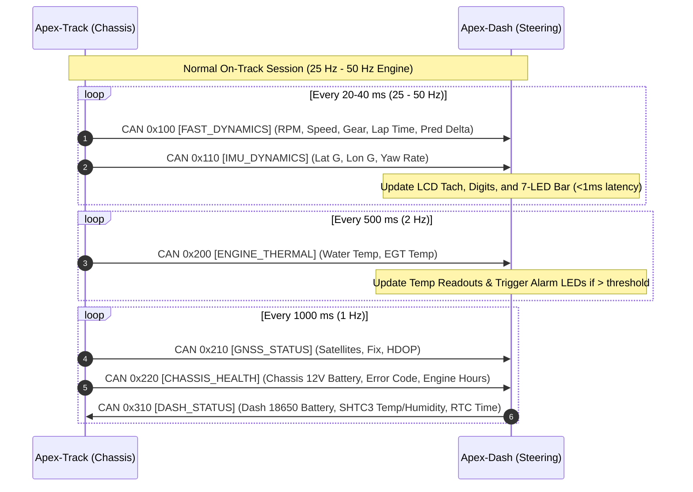
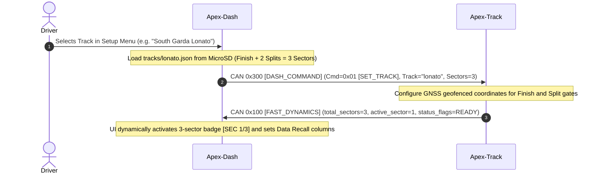

# Apex-Twin Virtual CAN-FD Telemetry & Communication Protocol

This document specifies the communication protocol, frame formats, and data serialization between **Apex-Track** (chassis-mounted acquisition module) and **Apex-Dash** (steering-wheel display unit).

---

## 1. Architectural Principles

Apex-Twin implements a **Virtual CAN-FD** protocol layer over wireless (ESP-NOW 2.4 GHz) and physical (ESP32 TWAI / CAN 2.0B & CAN-FD) transports:

```mermaid
flowchart TD
    subgraph Apex-Track ["Apex-Track (Chassis Unit)"]
        Sensors["Sensors (RPM, Thermocouples, RTK GNSS, IMU)"]
        LapTimer["GPS Lap Timer & Predictive Delta Engine"]
        TrackCAN["Virtual CAN-FD Dispatcher"]
    end

    subgraph Transport ["Physical or Wireless Transport"]
        ESPNow["ESP-NOW 2.4 GHz (Sub-2ms Wireless)"]
        TwaiCAN["ESP32 TWAI / CAN-FD (2-Wire Physical Harness)"]
    end

    subgraph Apex-Dash ["Apex-Dash (Steering Unit)"]
        DashCAN["Virtual CAN-FD Receiver & Priority Queue"]
        UI["4.2\" Reflective LCD (5 HUD Views)"]
        LEDs["WS2812 7-LED Shift / Alarm Light Bar"]
        LocalSensors["Sensirion SHTC3 (Weather) & PCF85063A RTC"]
    end

    Sensors --> LapTimer --> TrackCAN
    TrackCAN <==> ESPNow <==> DashCAN
    TrackCAN -.-> TwaiCAN <.- DashCAN
    DashCAN --> UI
    DashCAN --> LEDs
    LocalSensors --> DashCAN
```

### Key Design Pillars
1. **CAN-FD Compatibility:** Uses standard 11-bit CAN identifiers and variable payload sizes up to 64 bytes (`DLC` $0 \dots 15$, length up to 64 bytes).
2. **Deterministic Priority Arbitration:** Critical telemetry (RPM, Speed, Lap Delta) is assigned low CAN IDs (`0x100 - 0x130`) to guarantee delivery over slow monitoring metrics (`0x200 - 0x220`).
3. **Transport Agnostic:** The exact same message schemas and decoders operate seamlessly over wireless **ESP-NOW** and wired **TWAI CAN**.
4. **Dynamic Sector Engine (1 to 5 Sectors):** Intermediate splits are dynamic ($0 \le N \le 4$), supporting single-loop tracks up to 5-sector championship tracks.

---

## 2. CAN-FD Identifier Allocation Matrix

### A. Downlink: Apex-Track $\longrightarrow$ Apex-Dash (Chassis Telemetry)

| CAN ID | Name | Priority | Frequency | Max DLC | Description |
| :--- | :--- | :---: | :---: | :---: | :--- |
| **`0x100`** | `CAN_ID_FAST_DYNAMICS` | **Highest (P0)** | 25–50 Hz | 16 B | Engine RPM, ground speed, gear, shift flags, active sector, current lap time, and predictive delta. |
| **`0x110`** | `CAN_ID_IMU_DYNAMICS` | **High (P1)** | 25–50 Hz | 16 B | 3-axis linear accelerations (Lat G, Lon G, Vert G) and 3-axis angular rates (Yaw, Pitch, Roll). |
| **`0x120`** | `CAN_ID_SECTOR_EVENT` | **High (P1)** | On Event | 24 B | Event-driven notification triggered immediately upon crossing a start/finish or intermediate split gate. |
| **`0x200`** | `CAN_ID_ENGINE_THERMAL`| **Medium (P2)** | 2 Hz | 12 B | Water coolant temperature, exhaust gas temperature (EGT), and cylinder head/under-plug temperature. |
| **`0x210`** | `CAN_ID_GNSS_STATUS` | **Low (P3)** | 1 Hz | 24 B | Coordinates (Lat/Lon), altitude, heading, GPS speed, satellites visible, fix type, and HDOP. |
| **`0x220`** | `CAN_ID_CHASSIS_HEALTH`| **Low (P3)** | 1 Hz | 16 B | Chassis battery voltage, diagnostic error bitfields, total engine runtime hours, and piston run hours. |

### B. Uplink: Apex-Dash $\longrightarrow$ Apex-Track (Commands & Local Sensors)

| CAN ID | Name | Priority | Frequency | Max DLC | Description |
| :--- | :--- | :---: | :---: | :---: | :--- |
| **`0x300`** | `CAN_ID_DASH_COMMAND` | **High (P1)** | On Demand | 16 B | Track selection command, session start/stop, IMU tare calibration, lap timer reset. |
| **`0x310`** | `CAN_ID_DASH_STATUS` | **Low (P3)** | 1 Hz | 16 B | Dash 18650 battery voltage/%, onboard SHTC3 ambient temperature & humidity, RTC epoch timestamp. |

---

## 3. Data Byte Layouts & Scaling

All multi-byte numeric values are encoded in **Little-Endian** byte order.

### `0x100`: `CAN_ID_FAST_DYNAMICS` (DLC = 16)
Transmitted at 25–50 Hz for steering display and LED shift light animation.

| Byte Offset | Field | Type | Scale / Unit | Range | Description |
| :---: | :--- | :--- | :---: | :---: | :--- |
| `0 - 1` | `rpm` | `uint16_t` | $1\text{ RPM}$ | $0 - 25{,}000\text{ RPM}$ | Filtered engine crankshaft RPM. |
| `2 - 3` | `speed_kmh` | `uint16_t` | $0.05\text{ km/h}$ | $0.0 - 250.0\text{ km/h}$ | Instantaneous GPS/wheel ground speed ($v = \text{val} \times 0.05$). |
| `4` | `gear` | `uint8_t` | Raw | $0 - 6$ | $0 = \text{Neutral}$, $1 - 6 = \text{Gear}$. |
| `5` | `status_flags` | `uint8_t` | Bitfield | - | `bit 0`: Shift light active<br/>`bit 1`: Over-rev warning<br/>`bit 2`: Session running |
| `6` | `current_sector` | `uint8_t` | Raw | $1 - 5$ | Active circuit sector ($1 \dots \text{total\_sectors}$). |
| `7` | `total_sectors` | `uint8_t` | Raw | $1 - 5$ | Total sectors configured for active circuit ($1 \dots 5$). |
| `8 - 9` | `lap_number` | `uint16_t` | Raw | $0 - 65{,}535$ | Monotonic active lap counter. |
| `10 - 13`| `lap_time_ms` | `uint32_t` | $1\text{ ms}$ | $0 - 3{,}600{,}000\text{ ms}$ | Elapsed time in current lap. |
| `14 - 15`| `pred_delta_ms` | `int16_t` | $1\text{ ms}$ | $\pm 32{,}767\text{ ms}$ | Predictive time delta to reference best lap (Negative = Faster, Positive = Slower). |

---

### `0x110`: `CAN_ID_IMU_DYNAMICS` (DLC = 16)
Transmitted at 25–50 Hz for G-G diagram and chassis dynamics analysis.

| Byte Offset | Field | Type | Scale / Unit | Range | Description |
| :---: | :--- | :--- | :---: | :---: | :--- |
| `0 - 1` | `lateral_g` | `int16_t` | $0.01\text{ G}$ | $\pm 4.00\text{ G}$ | Cornering acceleration (Positive = Right, Negative = Left). |
| `2 - 3` | `longitudinal_g` | `int16_t` | $0.01\text{ G}$ | $\pm 4.00\text{ G}$ | Longitudinal acceleration (Positive = Accel, Negative = Braking). |
| `4 - 5` | `vertical_g` | `int16_t` | $0.01\text{ G}$ | $\pm 8.00\text{ G}$ | Vertical / curb strike acceleration. |
| `6 - 7` | `yaw_rate_dps` | `int16_t` | $0.1^\circ\text{/s}$ | $\pm 300.0^\circ\text{/s}$ | Angular yaw velocity around vertical Z-axis. |
| `8 - 9` | `pitch_deg` | `int16_t` | $0.05^\circ$ | $\pm 45.0^\circ$ | Chassis pitch angle. |
| `10 - 11`| `roll_deg` | `int16_t` | $0.05^\circ$ | $\pm 45.0^\circ$ | Chassis roll angle. |
| `12 - 15`| `reserved` | `uint32_t` | - | - | Reserved for steering angle / brake pressure. |

---

### `0x120`: `CAN_ID_SECTOR_EVENT` (DLC = 24)
Asynchronous event broadcasted immediately when crossing S/F line or an intermediate split.

| Byte Offset | Field | Type | Scale / Unit | Description |
| :---: | :--- | :--- | :---: | :--- |
| `0` | `gate_type` | `uint8_t` | Enum | `0x01` = Start/Finish Line (New Lap)<br/>`0x02` = Intermediate Split Gate |
| `1` | `sector_index` | `uint8_t` | Raw ($1 - 5$) | The sector that was just completed. |
| `2 - 3` | `lap_number` | `uint16_t` | Raw | Lap number completed. |
| `4 - 7` | `split_time_ms` | `uint32_t` | $1\text{ ms}$ | Sector elapsed split time in milliseconds. |
| `8 - 11` | `lap_time_ms` | `uint32_t` | $1\text{ ms}$ | Total lap time (valid on S/F crossing). |
| `12 - 13`| `split_delta_ms` | `int16_t` | $1\text{ ms}$ | Delta to personal best sector split time. |
| `14 - 15`| `top_speed_kmh` | `uint16_t` | $0.05\text{ km/h}$ | Maximum speed achieved in this sector/lap. |
| `16 - 17`| `max_rpm` | `uint16_t` | $1\text{ RPM}$ | Maximum engine RPM reached in this sector/lap. |
| `18` | `is_new_best` | `uint8_t` | Bool | `1` = New overall session best lap. |
| `19 - 23`| `reserved` | `uint8_t[5]` | - | Reserved padding. |

---

### `0x200`: `CAN_ID_ENGINE_THERMAL` (DLC = 12)
Broadcasted at 2 Hz for coolant/exhaust safety monitoring and overheat alarms.

| Byte Offset | Field | Type | Scale / Unit | Range | Description |
| :---: | :--- | :--- | :---: | :---: | :--- |
| `0 - 1` | `water_temp_c` | `int16_t` | $0.1^\circ\text{C}$ | $-20.0 \dots 140.0^\circ\text{C}$ | Water radiator coolant temperature. |
| `2 - 3` | `exhaust_temp_c`| `uint16_t` | $1.0^\circ\text{C}$ | $0 \dots 1100^\circ\text{C}$ | Exhaust gas temperature (EGT thermocouple). |
| `4 - 5` | `head_temp_c` | `int16_t` | $0.1^\circ\text{C}$ | $-20.0 \dots 250.0^\circ\text{C}$ | Cylinder head / sparkplug under-washer temp. |
| `6 - 7` | `intake_temp_c` | `int16_t` | $0.1^\circ\text{C}$ | $-20.0 \dots 80.0^\circ\text{C}$ | Airbox / intake manifold temperature. |
| `8 - 11` | `reserved` | `uint32_t` | - | - | Reserved. |

---

### `0x210`: `CAN_ID_GNSS_STATUS` (DLC = 24)
Broadcasted at 1 Hz for GPS lock verification and paddock review.

| Byte Offset | Field | Type | Scale / Unit | Description |
| :---: | :--- | :--- | :---: | :--- |
| `0 - 3` | `latitude_deg` | `int32_t` | $10^{-7\ \circ}$ | Latitude ($\text{deg} = \text{val} / 10^7$). |
| `4 - 7` | `longitude_deg`| `int32_t` | $10^{-7\ \circ}$ | Longitude ($\text{deg} = \text{val} / 10^7$). |
| `8 - 9` | `altitude_m` | `int16_t` | $0.1\text{ m}$ | Elevation above MSL ($-500.0 \dots 5000.0\text{ m}$). |
| `10 - 11`| `heading_deg` | `uint16_t` | $0.01^\circ$ | Course over ground ($0.00 \dots 359.99^\circ$). |
| `12` | `satellites` | `uint8_t` | Raw | Satellites visible ($0 - 48$). |
| `13` | `fix_type` | `uint8_t` | Enum | `0` = None, `1` = 2D, `2` = 3D, `3` = DGPS, `4` = RTK-Float, `5` = RTK-Fixed. |
| `14 - 15`| `hdop` | `uint16_t` | $0.01$ | Horizontal Dilution of Precision. |
| `16 - 23`| `reserved` | `uint8_t[8]` | - | Reserved. |

---

### `0x220`: `CAN_ID_CHASSIS_HEALTH` (DLC = 16)
Broadcasted at 1 Hz for diagnostic and electrical health.

| Byte Offset | Field | Type | Scale / Unit | Description |
| :---: | :--- | :--- | :---: | :--- |
| `0 - 1` | `battery_mv` | `uint16_t` | $1\text{ mV}$ | Chassis 12V / LiFePO4 battery voltage ($0 - 18{,}000\text{ mV}$). |
| `2 - 3` | `error_flags` | `uint16_t` | Bitfield | `bit 0`: GPS lost fix<br/>`bit 1`: IMU comm failure<br/>`bit 2`: SD write fault<br/>`bit 3`: Water probe fault<br/>`bit 4`: EGT probe fault<br/>`bit 5`: Under-voltage |
| `4 - 7` | `engine_hours_s`| `uint32_t` | $1\text{ s}$ | Total cumulative engine running seconds. |
| `8 - 11` | `piston_hours_s`| `uint32_t` | $1\text{ s}$ | Cumulative running seconds since last piston rebuild. |
| `12 - 15`| `log_file_index`| `uint32_t` | Raw | Active MicroSD binary telemetry log file counter. |

---

### `0x300`: `CAN_ID_DASH_COMMAND` (DLC = 16)
Transmitted from Apex-Dash to Apex-Track when settings or circuit changes occur.

| Byte Offset | Field | Type | Description |
| :---: | :--- | :--- | :--- |
| `0` | `cmd_id` | `uint8_t` | `0x01` = Set Active Track<br/>`0x02` = Start Session<br/>`0x03` = Stop Session<br/>`0x04` = Zero/Tare IMU<br/>`0x05` = Reset Piston Timer |
| `1` | `sub_param` | `uint8_t` | Sub-parameter or sector count. |
| `2 - 5` | `param_u32` | `uint32_t` | Primary parameter (e.g. track CRC hash or epoch time). |
| `6 - 15` | `payload` | `uint8_t[10]`| Optional string identifier (e.g. `lonato\0`). |

---

### `0x310`: `CAN_ID_DASH_STATUS` (DLC = 16)
Broadcasted at 1 Hz from Apex-Dash to Apex-Track.

| Byte Offset | Field | Type | Scale / Unit | Description |
| :---: | :--- | :--- | :---: | :--- |
| `0 - 1` | `dash_bat_mv` | `uint16_t` | $1\text{ mV}$ | Steering unit 18650 cell voltage ($3000 - 4250\text{ mV}$). |
| `2` | `dash_bat_pct`| `uint8_t` | $1\%$ | Remaining battery percentage ($0 - 100\%$). |
| `3 - 4` | `ambient_temp_c`|`int16_t` | $0.1^\circ\text{C}$ | Ambient temperature from Sensirion SHTC3. |
| `5` | `ambient_hum_pct`|`uint8_t`| $1\%\text{ RH}$ | Ambient relative humidity from Sensirion SHTC3. |
| `6 - 9` | `rtc_epoch_s` | `uint32_t` | Unix Epoch | Wall-clock time from PCF85063A RTC (used to timestamp chassis logs). |
| `10 - 15`| `reserved` | `uint8_t[6]` | - | Reserved. |

---

## 4. Communication Sequence Diagrams

### A. Live Racing Telemetry (Multi-Rate Streams)



---

### B. Sector Split & Start/Finish Crossing Event

```mermaid
sequenceDiagram
    autonumber
    participant GNSS as Quectel Dual-Band GNSS
    participant T as Apex-Track
    participant D as Apex-Dash

    GNSS->>T: 25 Hz High-Rate PVT Navigation Solution
    Note over T: Detect Gate Crossing (Segment Intersection)
    
    rect rgb(30, 45, 60)
    Note over T,D: Sector 1 Gate Crossed (Split 1)
    T->>D: CAN 0x120 [SECTOR_EVENT] (Gate=Split, Sec=1, SplitTime=16.12s, Delta=-0.15s)
    T->>D: CAN 0x100 [FAST_DYNAMICS] (active_sector=2, current_sector=2)
    Note over D: Strobe Purple/Cyan Split LEDs & Flash LCD Split Banner
    end

    rect rgb(40, 55, 30)
    Note over T,D: Start/Finish Gate Crossed (Lap Complete)
    T->>D: CAN 0x120 [SECTOR_EVENT] (Gate=Finish, Lap=3, LapTime=48.42s, NewBest=TRUE)
    T->>D: CAN 0x100 [FAST_DYNAMICS] (lap_number=4, active_sector=1, lap_time_ms=0)
    Note over D: Flash Best Lap Inverted Banner, Hold Lap Display (5s), Update Data Recall
    end
```



---

### C. Track Selection & Session Handshake


